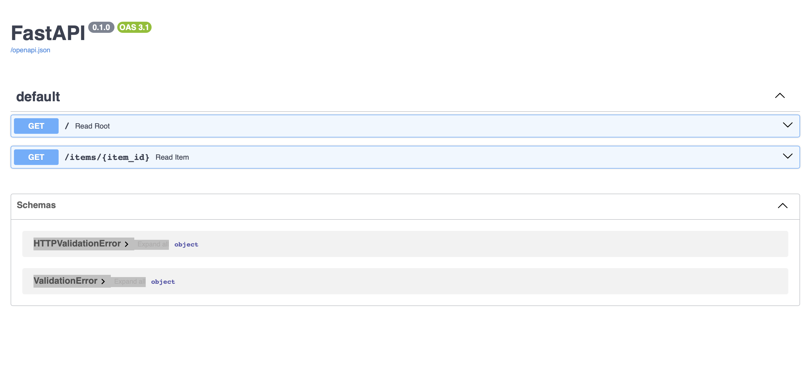

<p align="center">
  <a href="https://fastapi.tiangolo.com"></a>
</p>

FastAPI is a modern, fast (high-performance), web framework for building APIs with Python based on standard Python type hints.

This repository contains practical implementations covering the essential aspects of FastAPI development.

## **📂 Featured Implementations**

*   [FastAPI with MongoDB](mongo_db)
*   [FastAPI with MySQL](mysql)
*   [FastAPI with Postgresql](postgresql)
*   [FastAPI with Redis](redis)
*   [FastAPI with SQLAlchemy](sqlalchemy)
*   [FastAPI with Pydantic](basics_of_pydantic)
*   [FastAPI with Pytest](fastapi_pytest)
*   [FastAPI with Jinja2](jinja2)

## 📚 **Core Concepts**

- **Pydantic Integration**: Data validation, parsing, and serialization
- **Database Connectivity**: Multiple database implementations
- **Template Rendering**: Dynamic HTML generation with Jinja2
- **Testing**: Comprehensive API testing with pytest
- **Modern Python**: Type hints, async/await, and best practices

## 🛠️ **Tech Stack**

- **Framework**: FastAPI
- **Python**: 3.13+
- **Data Validation**: Pydantic 
- **Databases**: 
  - PostgreSQL 
  - MySQL
  - MongoDB
  - SQLite
- **Caching**: Redis
- **Templates**: Jinja2 
- **Testing**: pytest 
- **Server**: Uvicorn 

## **Prerequisites**

- Python 3.13 or higher
- uv package manager 

## **Installation**

1. **Install uv**:
```bash
# For macOS:
brew update
brew install uv

# For Windows - Open PowerShell as Administrator and run the below command:
powershell -ExecutionPolicy ByPass -c "irm https://astral.sh/uv/install.ps1 | iex"

# For more on installation guide:
👉 https://docs.astral.sh/uv/getting-started/installation/

```

## Local Setup 👨🏼‍💻

1. **Clone the repository**:
```bash
git clone https://github.com/karthikponna/fast_api.git
cd fast_api
uv sync
```

## Example

Create a file `main.py` with:

```Python
from typing import Union

from fastapi import FastAPI

app = FastAPI()


@app.get("/")
def read_root():
    return {"Hello": "World"}


@app.get("/items/{item_id}")
def read_item(item_id: int, q: Union[str, None] = None):
    return {"item_id": item_id, "q": q}
```

### Run the server 

```bash
uvicorn main:app --reload
```

### Interactive API docs 

FastAPI will handle API docs for you.

Now go to <a href="http://127.0.0.1:8000/docs" class="external-link" target="_blank">http://127.0.0.1:8000/docs</a>.

You will see the automatic interactive API documentation (provided by <a href="https://github.com/swagger-api/swagger-ui" class="external-link" target="_blank">Swagger UI</a>):



